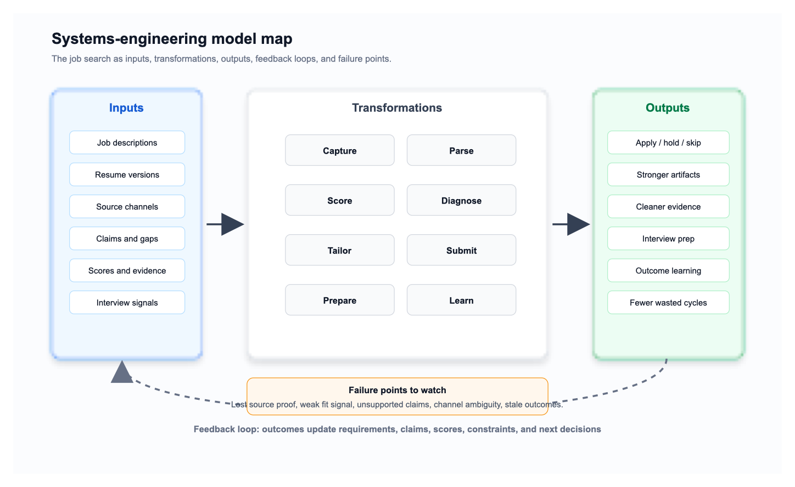
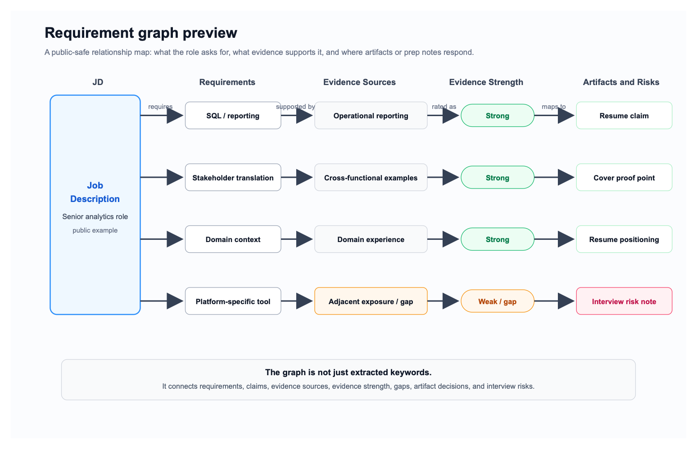
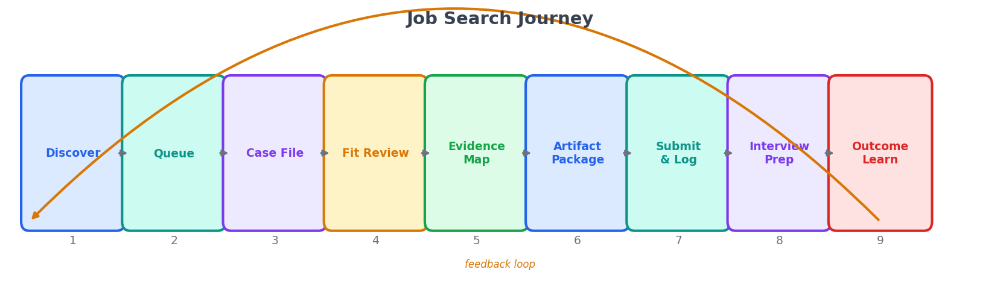
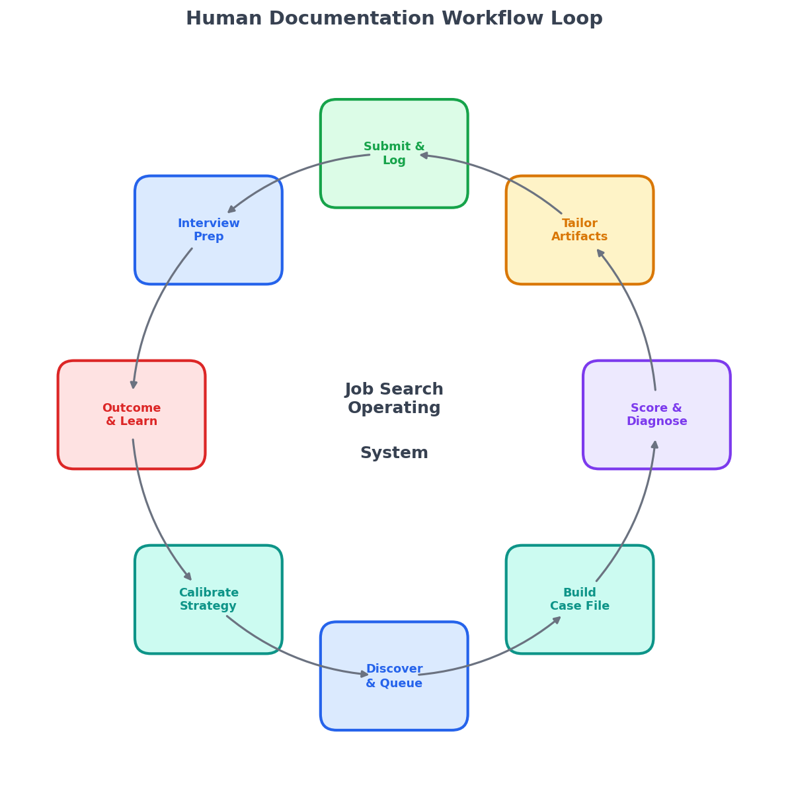
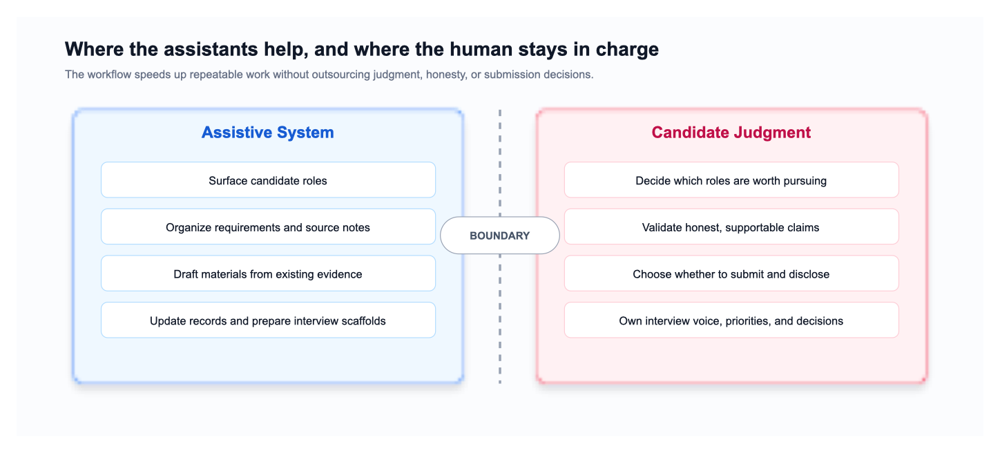

# From Job Applications to a Job Search Operating System

At first, the problem looked simple: apply to better jobs, faster.

But the deeper we got into the search, the more obvious it became that the real challenge was not just writing resumes or finding postings. It was building a repeatable system that could handle discovery, evaluation, tailoring, application tracking, interview preparation, and learning from outcomes without losing the thread.

What started as a job application workflow gradually became a structured operating system for career search.

When I say "we," I mean the small search committee of one human and a few tireless digital assistants. One of us has judgment, taste, and actual stakes. The others are very good at reading the same kind of document 40 times without sighing dramatically.

---

## The STAR Version

**Situation:** The job search had too many moving parts—job boards, resumes, cover letters, portals, confirmation evidence, interviews, and follow-ups. Context was scattered across tools and memory.

**Task:** Build a repeatable workflow that improved quality and reduced manual friction without exaggerating experience or losing application history.

**Action:** Structured the process into a workflow with case files, scoring rubrics, tracker updates, resume/cover letter generation rules, PDF verification, source-chain preservation, discovery intake, and handoffs.

**Result:** The workflow became a career-search operating system: faster, more consistent, more auditable, and better aligned with interview conversion rather than raw application volume.

---

## The Better Story

But the better story is not just STAR. It is a pyramid story:

At the top is the outcome: a disciplined, assisted job search workflow.

Under that is the operating system: case files, tracker, resume versions, interview prep, inbox scans, and handoffs.

Under that is the evidence layer: source chains, portal confirmations, JD snapshots, scoring matrices, claim banks, and generated artifacts.

And at the foundation is the philosophy: systematize the repeatable parts, preserve the truth, and keep the human judgment where it belongs.

That is the journey. Not from "manual applications" to "the assistants do everything," but from scattered effort to a system that can learn, compound, and keep moving.

---

## The Larger Vision (TBD)

The next version is not a prettier tracker. The larger vision is a decision system under uncertainty.

Each expert lens stress-tests a different part of the same operating system. The systems-thinking lens comes first because it defines the frame: distinctions, relationships, feedback loops, and perspectives. Within that frame, the hiring and HR lens represents one of the most important perspectives: how the workflow compares with real screening, interview evaluation, and evidence-based candidate review. Systems engineering maps the operating flow. Operations research asks how scarce resources should be allocated. Analytics and product thinking ask what becomes measurable once the data is large enough to deserve confidence. Agentic workflow asks whether every assistant pass leaves behind durable value instead of a very impressive pile of chat confetti.

Together, these lenses turn the job search from a pile of applications into a decision system.

### Lens 1: Systems Thinking

If you looked at it like a systems-thinking expert, the first move would not be optimization. It would be asking better questions about the framework itself. What distinctions are we making between "saved," "worth pursuing," "prepared," "applied," and "alive"? What counts as a system: one job, one company, one resume version, the whole search, or the candidate's career strategy? What relationships matter: JD requirements to resume claims, source channel to confirmation evidence, score to outcome, gap to interview objection? And whose perspective is being used: recruiter, hiring manager, candidate, assistant, portal, or future interviewer?

In that sense, the workflow is a DSRP-style thinking system: distinctions, systems, relationships, and perspectives. It is also a Meadows-style feedback system, because every outcome changes the next search. It is a soft-systems problem, because the "right" answer depends on human meaning, not just math. And it is a learning system, because the goal is not only to process applications but to improve the way the search understands itself.

### Lens 2: Hiring and HR

If you looked at it like a hiring, recruiting, or HR expert, the question becomes: would this candidate survive the real screening path? Not in a vague "good fit" way, but through the practical filters that decide whether a resume gets read, whether the story holds together, whether the claims are credible, and whether the interview prep anticipates the questions a human evaluator is likely to ask.

That is where feedback from hiring, recruiting, and HR practitioners would be useful. Does this kind of workflow mirror the way strong candidates are actually screened? Where would a recruiter, HR partner, or hiring manager refine the evaluation notes? Could parts of this framework help job seekers prepare more honestly, or even help hiring teams compare candidates with clearer evidence and fewer assumptions? The point is not that the scoring model is finished. The point is that the workflow can be tested against the real hiring process, not just against the internet's favorite career advice: "just network," "use keywords," and "have you tried being magically referred?"

### Lens 3: Systems Engineering

If you looked at it like a systems engineer, the question becomes a model map: inputs, transformations, outputs, feedback loops, and failure points.



```text
INPUTS
  JD corpus
  resume versions
  source channels
  claims, gaps, scores
  application evidence
  interview signals
  outcomes

TRANSFORM
  capture -> parse -> score -> diagnose -> tailor -> submit -> prepare -> learn

OUTPUTS
  better decisions
  stronger artifacts
  cleaner evidence
  interview readiness
  fewer wasted cycles

FEEDBACK
  outcomes update role archetypes, gap handling, score interpretation,
  resume strategy, evidence rules, and next-action thresholds

WATCH
  lost source proof
  unsupported claims
  weak fit signal
  channel ambiguity
  stale outcomes
```

### Lens 4: Operations Research

If you looked at it like operations research, the search becomes a resource-allocation problem. Time is the scarce resource, and the system should protect it for higher-value work: better applications, interview prep, networking, rest, and actual life.

Let:

$$
\mathcal{J} = \{\text{candidate jobs}\}
$$

$$
\mathcal{A} = \{\text{skip}, \text{hold}, \text{apply baseline}, \text{tailor apply}, \text{pursue referral first}\}
$$

For each job \(j\), choose one action:

$$
x_j \in \mathcal{A}
$$

Objective:

$$
\max_{x_j \in \mathcal{A}}
\sum_{j \in \mathcal{J}}
\left[
V(j, x_j)
- C_t(j, x_j)
- C_e(j, x_j)
- C_a(j, x_j)
- R(j, x_j)
\right]
$$

Where:

$$
V(j, x_j)
= w_1 S_j
+ w_2 F_j
+ w_3 M_j
+ w_4 L_j
+ w_5 N_j
$$

Variable definitions:

| Term | Meaning in this job-search system |
|---|---|
| \(S_j\) | Interview-conversion score for job \(j\), measured by the structured scoring rubric: ATS retrieval, HumanFit, gate multiplier, credibility, and differentiation. |
| \(F_j\) | Strategic career fit, measured by a rubric score for target role family, seniority path, domain alignment, and future resume value. |
| \(M_j\) | Market/work-mode fit, measured from observable fields: salary band, location, remote/hybrid/onsite requirement, seniority level, sponsorship/eligibility, and commute feasibility. |
| \(L_j\) | Learning value, measured by count or score of reusable skills, recurring gaps addressed, interview practice value, and future claim-bank value. |
| \(N_j\) | Network value, measured by known contacts, referral path availability, recruiter/hiring-manager visibility, and company/role signal strength. |
| \(w_k\) | Weight assigned to each value component. Weights are set explicitly for the current search phase rather than inferred after the fact. |
| \(C_t(j, x_j)\) | Human time cost in minutes or hours: reading, tailoring, portal work, follow-up, interview prep, documentation, and review. |
| \(C_e(j, x_j)\) | Attention cost measured by observable proxies: number of context switches, number of open tasks, required review passes, portal complexity, and same-day workload. |
| \(C_a(j, x_j)\) | Agentic-assistant cost measured by tokens, dollars, tool calls, elapsed runtime, failed/repeated runs, and human verification time. |
| \(R(j, x_j)\) | Risk penalty measured by rubric flags: unsupported claim count, weak evidence count, channel uncertainty, missing confirmation proof, salary/work-mode mismatch, and privacy/compliance flags. |

Subject to:

$$
\sum_{j \in \mathcal{J}} C_t(j, x_j) \le T_{\text{week}}
$$

$$
\sum_{j \in \mathcal{J}} C_e(j, x_j) \le E_{\text{week}}
$$

$$
\sum_{j \in \mathcal{J}} C_a(j, x_j) \le A_{\text{week}}
$$

$$
\text{evidence}(j, x_j) = \text{supportable}
$$

$$
\text{hard constraints}(j) = \text{pass}
$$

$$
\text{deadline}(j, x_j) = \text{feasible}
$$

In plain English: do not spend 90 minutes, or a pile of assistant tokens, on a low-fit role just because it exists. Spend the next unit of effort where it creates the highest expected lift.

That opens the door to deeper questions:

- Which role archetypes are worth pursuing under limited time?
- Which gaps appear often enough to justify upskilling?
- Which resume version creates the most lift for which role family?
- Which claims connect to the most high-value opportunities?
- Which channels produce usable confirmation evidence and real responses?
- Which applications deserve tailoring, a referral-first attempt, or a clean skip?

### Lens 5: Analytics and Product

If you looked at it like an analytics or product expert, the temptation would be to build a dashboard immediately, preferably with enough charts to make the project look like it has entered its "founder mode" era. But the honest answer is more disciplined: first define the events, states, measures, and decision points. Then wait until the sample size is large enough to support insight instead of decorative certainty.

The useful future questions are measurable: which role families produce the strongest response rate, which channels generate real employer engagement, which gaps repeatedly suppress the score, which resume version performs best by job archetype, and which prep notes predict interview objections. Until then, the analytics layer is a measurement design, not a fake oracle.

### Lens 6: Agentic Workflow

If you looked at it like an agentic workflow, the scarce resource is not only time. It is attention and context. Every assistant pass should create durable state: a case-file update, a claim mapping, a gap note, a score movement, a next action, or an interview-prep asset. The goal is not long chat analysis. The goal is to make every token count by turning temporary reasoning into reusable evidence.

The eventual intelligence layer is a graph:

```text
JD Corpus
→ Requirement Graph
→ Claim / Evidence Graph
→ Fit Scoring Model
→ Constraint Filter
→ Decision Engine
→ Artifact Builder
→ Application Evidence Log
→ Outcome Feedback
→ Calibration Layer
```

The important point is that the graph is not just "requirements extracted from JD." It is a relationship map among job requirements, resume claims, evidence sources, evidence strength, gaps, artifact decisions, and interview risks.



That is the deeper theme: not "more applications," but better bets. What kinds of opportunities does the evidence network naturally win? Which constraints repeatedly block otherwise-good roles? Where should the next unit of effort go for the highest conversion lift?

For now, the sample size is still too small to pretend this is a predictive analytics engine. The honest current state is a disciplined decision model. The future state is a calibrated search intelligence system.

---

## The User Story

The STAR version is the clean answer. The better story is the pyramid. But the lived story is a user story:

> As a candidate managing many job opportunities across many channels, I needed the system to preserve context, evidence, decisions, and next actions so I could move forward without relying on memory or redoing the same work.

That became the product requirement. The system was not built because job applications are fun to document. It was built because every undocumented detail eventually became friction.

### User Need 1: Preserve Source Truth

> As a candidate, I need to know where each job came from and where I actually applied so I can answer source questions correctly and reconstruct the application path later.

A job might be discovered on LinkedIn but submitted through Workday. Another might begin as a Handshake lead and end in a company portal. Without separating discovery source, discovery URL, application channel, and apply URL, the system would collapse different facts into one vague memory.

The workflow response was to preserve the source chain for every case.

### User Need 2: Preserve Submission Evidence

> As a candidate, I need portal, platform, email, and artifact evidence preserved so application status does not depend on whether an email receipt exists.

Some portals show a submitted application without sending an email. Some LinkedIn Easy Apply submissions seem to live mainly inside the platform. That ambiguity forced the system to stop treating email as the only valid proof.

The workflow response was to accept strong portal or platform evidence, record what was seen, and update the tracker from evidence instead of waiting forever for a receipt that may never arrive.

### User Need 3: Make Fit Decisions Explicit

> As a candidate, I need each JD evaluated against a specific resume version and application channel so I can decide whether to apply, tailor, hold, pursue a referral first, or skip.

The biggest shift was realizing that fit is not abstract. The useful unit is:

```text
Specific JD × Specific Resume Version × Application Channel
```

That made decisions clearer. A role could be strong for a healthcare BI resume and weaker for a general business analysis resume. A role could be worth pursuing through a referral but not worth cold applying.

The workflow response was to make every application a traceable decision case.

### User Need 4: Preserve Claim Integrity

> As a candidate, I need every resume claim mapped to evidence so tailoring improves fit without overclaiming.

Tailoring is useful only if it stays honest. The system had to distinguish between exact experience, contextual experience, adjacent experience, weak evidence, and missing evidence.

The workflow response was to keep internal gap analysis inside the case file and keep candidate-facing artifacts confident, supported, and free of evaluator language.

### User Need 5: Make Artifacts Submit-Ready

> As a candidate, I need generated resumes and cover letters to follow format and QA rules so the final application package is polished, consistent, and defensible.

Formatting failures became system requirements. A resume could have the right content but fail visually if headings, bullets, borders, fonts, or PDFs were not checked. The system learned that every `.docx` needs a matching PDF and every candidate-facing artifact needs a final language and formatting pass.

The workflow response was to treat resume generation as artifact production, not just writing.

### User Need 6: Make the Next Action Obvious

> As a candidate, I need every case file to show status and next action so I can resume work after a break without rereading the entire job description.

The system had to support interruption. If the candidate returns tomorrow, the case file should answer: What is this job? Where did it come from? Did I apply? What did I submit? What is the next action?

The workflow response was to make the case file the spine of the system.

### User Need 7: Learn From Outcomes

> As a candidate, I need outcomes and interview signals logged so every application improves the next decision.

A rejection, a screen, or an interview is not just an outcome. It is feedback. The system records what happened, what questions came up, what objections appeared, and what should change next.

The workflow response was to turn the search into a learning loop instead of a pile of disconnected applications.

---

## The Philosophy

The user stories explain why the system exists. The philosophy explains how it should behave.

The result is a human-in-the-loop workflow. The assistants help with scanning, parsing, drafting, formatting, and tracking. The human still makes the judgment calls: which jobs matter, which applications to submit, when to disclose sensitive information, and how to choose between speed and quality. That boundary matters. The goal was never to spray applications everywhere. The goal was interview conversion.

The system now has a few core principles:

1. **Traceability** — Every application traces back to discovery, evaluation, and submission.
2. **Contextual scoring** — The same person scores differently per role, resume version, and channel.
3. **Separation of concerns** — Internal notes stay in case files. Candidate-facing materials stay confident.
4. **Assistance boundaries** — Assistants handle parsing, drafting, and tracking. Judgment stays human.
5. **No black holes** — Every application is logged from discovery to outcome.
6. **Learning loops** — Outcomes refine scoring, positioning, and next prep cycle.

---

## The System Response



---

The system response was to turn a fragile manual loop into a sequence of checkpoints:

```text
discover -> queue -> case file -> fit review -> evidence map -> artifact package -> submission log -> interview prep -> outcome learning
```

Each checkpoint exists because a user need appeared. Source confusion became source-chain tracking. Missing receipts became portal/platform evidence rules. Resume drift became claim mapping. Formatting failures became artifact QA. Interrupted work became next-action tracking.

The system is not just "make a resume." It is a way to keep the whole search evidence-backed without turning the candidate into a copy-paste intern for their own life.

The public lesson is the shape of the work, not the exact machinery. Some recipes stay in the kitchen.

---

## The Operating System in Practice



---

## The Public Folder Shape

The real workspace has more detail than this, but the public shape looks like:

```
career_search/
├── claim_bank.docx                 ← All factual claims + evidence
├── resume_v1_default.docx          ← Baseline version
├── resume_v2_healthcare.docx       ← Specialized versions
├── resume_v3_analytics.docx
├── resume_v4_business_analysis.docx
├── cover_letter_[company].docx
│
└── job_tracking/
    ├── README.md                      ← Workflow authority
    ├── case_file_template.md          ← Case file schema
    ├── scoring_rubric.md              ← Evaluation criteria
    ├── discovery_notes.md             ← Intake rules and reminders
    ├── tracker.xlsx                   ← Tracker and status index
    │
    ├── cases/
    │   ├── md/                        ← Active case files
    │   └── pdf/                       ← JD snapshots
    │
    ├── inbox/                         ← Discovery handoffs
    ├── interview_prep/                ← Prep notes per role
    ├── company_research/              ← Research snapshots
    ├── closed/                        ← Archived applications
    │
    └── private_helpers/
        └── [implementation details intentionally omitted]
```

The case files are the spine. Everything else flows from them.

### A Case File in Action

Here's what a real case file looks like (anonymized):

```markdown
# YYYY-MM-DD Company Name – Senior Analytics Role

## JD Snapshot
**Title:** Senior Data Analyst / BI Lead
**Company:** [Insurance/Healthcare/Finance Company]
**Seniority:** 5+ years  
**Salary:** $110–140k (if disclosed)

### Parsed Requirements
- 5+ years analytics / BI experience
- Domain experience preferred
- SQL, Python or R
- Data governance, documentation  
- Stakeholder management  

## Resume Fit Assessment

**Score: 81/100**

**Strengths:**
- 6+ years analytics (exceeds requirement)
- Relevant domain context
- SQL expertise (strong)
- Reporting rigor and data governance (strong)

**Gaps:**
- No formal [domain] experience (adjacent: [similar experience])
- Tool transfer needed (transferable, but not proven in this tool)

**Positioning:** Emphasize data rigor, documentation discipline, stakeholder skills.

## Resume Version Selected
**Version:** resume_v3_analytics.docx
**Changes:** Added metric on "documentation standards across teams"; emphasized "data governance in regulated environment"

## Cover Letter
**Theme:** Turn business questions into clear data models, validated reports, and documented processes.

## Application Log
| Date | Channel | Status | Confirmation |
|---|---|---|---|
| YYYY-MM-DD | Careers portal | Applied | [Confirmation ID] |
| YYYY-MM-DD | Email outreach | Follow-up sent | — |

## Interview Prep
**Key areas:** Domain operations, data governance, stakeholder communication.

**30-second pitch:**  
I help teams translate operational questions into reliable reporting and documented data processes.

## Outcome
- Date: [TBD]
- Result: [Screen scheduled / Rejected / Pending]
- Notes: [Key feedback or next steps]
```

Every application is logged in this spirit. Every decision is traceable. Every claim is mapped to evidence. The system doesn't require heroic memory; it requires good documentation and fewer mystery tabs.

---

## Where The Assistants Help



---

## What This Costs and Saves

**Setup:** A meaningful up-front build. Templates, folder structure, tracker fields, writing rules, and review habits all had to be created before the system paid off.

**Time math per application:**
- Manual workflow: 90 minutes (find → parse → score → tailor → cover letter → log)
- System workflow: 18 minutes (review prepared case file, edit resume, personalize cover letter)
- **Savings: 72 minutes per application**

Over enough applications, that compounds quickly. The exact break-even point depends on how much tailoring each role needs, but the pattern is obvious: the more serious the search, the more the structure pays for itself.

**Maintenance:** Search criteria drift, portals change, and the tracker needs pruning. The system is helpful, but it is not a magical employment vending machine. Rude, honestly.

**Quality metric:** We are not pretending there is enough sample size yet for a real predictive model or a proper analytics dashboard. For now, the tracker is a tracker. The goal is disciplined learning: which roles get screens, which stories land, where the gaps appear, and what should change next.

---

## What Happens in Practice

Morning: The search workflow produces a shortlist of new opportunities with source notes and quick-fit signals.

Mid-morning: The candidate marks 3 as "tier 1 — pursue immediately." The role details are captured, organized, and checked against the existing resume strategy.

Late morning: For the tier 1 roles, case files are built. The first one shows a strong match with a few flagged gaps. A draft resume package is prepared. The candidate reads it, adjusts the language, and exports final files.

Later: Cover letter is generated from a template with placeholders for personalization. The candidate adds one paragraph about why this specific company. Marks it ready.

Before lunch: The candidate logs into the career portal and uploads the tailored resume and cover letter. Copies the application details (date, confirmation #, channel) into the case file.

**Total intake-to-application time for one role: 20 minutes.** Without the system: 60 minutes.

Three roles follow the same flow. Combined intake-to-application time: 60 minutes for 3 applications. Manually: 3 hours.

That is the practical result: not a perfect machine, not a shortcut around judgment, and not a dashboard pretending to know more than the data can support. It is a way to keep the search honest, traceable, and moving.

The journey was not from "manual applications" to "automation does everything." It was from scattered effort to a working system: one that preserves truth, reduces wasted motion, learns from outcomes, and gives the human enough clarity to make the next decision well.
